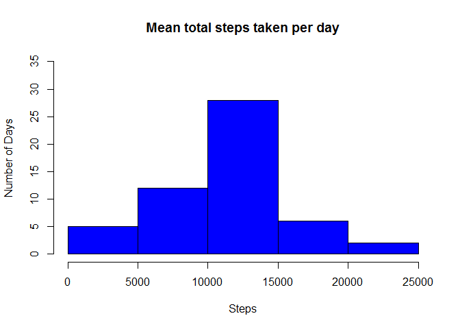
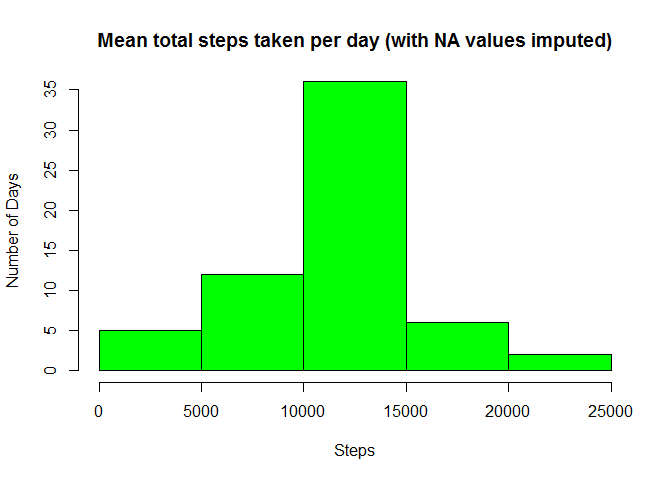

# Reproducible Research: Peer Assessment 1


## Loading and preprocessing the data


```r
unzip("activity.zip")
walkdata <- read.csv("activity.csv")
```


## What is the mean total number of steps taken per day?

```r
totalSteps <- aggregate(steps ~ date, data = walkdata, sum, na.rm = TRUE)
hist(totalSteps$steps)
```

<!-- -->

```r
meanSteps <- mean(totalSteps$steps)
medianSteps <- median(totalSteps$steps)
```

* The mean of the total number of steps taken per day is: 10766.2
* The median of the total number of steps taken per day is: 10765


## What is the average daily activity pattern?

```r
stepsToInterval <- aggregate(steps ~ interval, data = walkdata, mean, na.rm = TRUE)
plot(steps ~ interval, data = stepsToInterval, type = "l")
```

<!-- -->


```r
max5Minute <- stepsToInterval[which.max(stepsToInterval$steps), ]$interval
```

* The 5-minute interval which on average across all the days in the dataset, contains the maximum number of steps is: 835


## Imputing missing values

```r
totalMissing <- sum(is.na(walkdata$steps))
```
* Total number of missing values in the dataset: 2304


```r
## Find the unique time slots:
allTimeSlots <- unique(walkdata$interval)
newdata <- walkdata

## Set missing data to the average number of steps for that time slot where
## there is not missing data This strategy is the mean for that 5-minute
## interval
setMissingData <- function(timeSlot) {
    newdata[which(walkdata$interval == timeSlot & is.na(walkdata$steps)), ]$steps <<- mean(walkdata[which(walkdata$interval == 
        timeSlot & !is.na(walkdata$steps)), ]$steps)
}

lapply(allTimeSlots, setMissingData)
```


```r
totalNewSteps <- aggregate(steps ~ date, data = newdata, sum, na.rm = TRUE)
hist(totalNewSteps$steps)
```

<!-- -->

```r
meanNewSteps <- mean(totalNewSteps$steps)
medianNewSteps <- median(totalNewSteps$steps)
```

* The imputed mean of the total number of steps taken per day is: 
    10766.2
* The imputed median of the total number of steps taken per day is: 
    10766.2


## Are there differences in activity patterns between weekdays and weekends?
